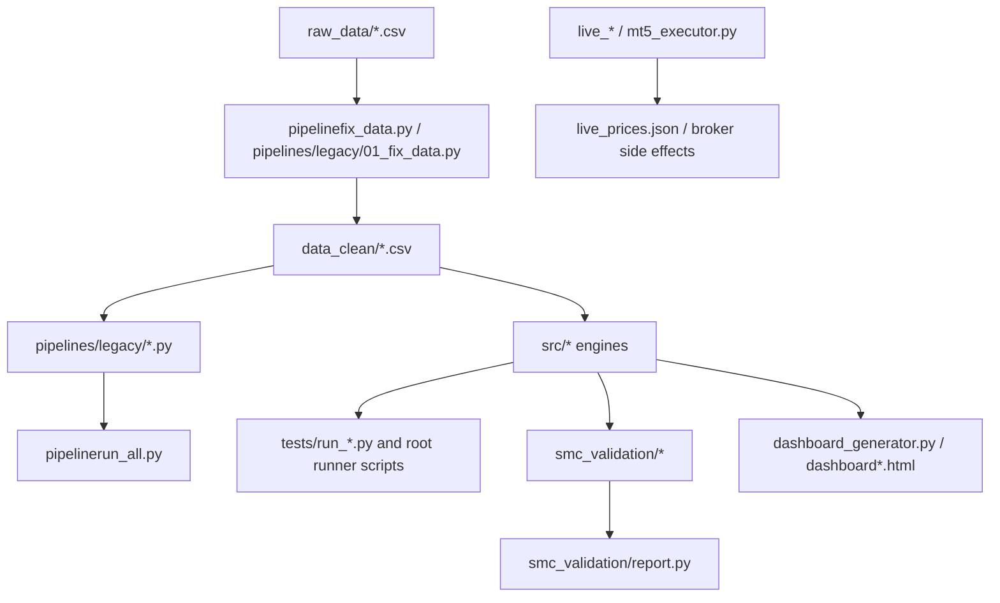

# KAN-1 Current-to-Target Architecture Map

## Purpose

This map connects the current repository layout to the governed target architecture without relocating files. It is a migration guide for future PRs after characterization coverage exists.

## Current Architecture

## Target Architecture From Repository Specs

| Target area | Intended responsibility | Current sources to map |
| --- | --- | --- |
| `core/` | Schemas, configuration, time/calendar, event bus, audit metadata. | `core/schemas.py`, pieces of `market_params.py`, run-manifest requirements from `DATA_CONTRACT.md`. |
| `pipelines/` | Ingestion, validation, normalization, resampling, orchestration. | `pipelinefix_data.py`, `pipelines/legacy/01_fix_data.py`, `02_resample_mtf.py`, `06_quality_check.py`, `run_all_pipeline.py`, `pipelinerun_all.py`. |
| `engines/` | Structure, liquidity, sessions, inventory, cross-market, probability. | `src/*_engine.py`, `engines/market_state_machine.py`, `regime.py`, `cross_market.py`, `delivery_quality.py`, `dealing_range.py`. |
| `services/` | Application workflows, report generation, dashboard/API surfaces. | `dashboard_generator.py`, `live_data_server.py`, `live_signal_engine.py`, root orchestration scripts. |
| `smc_validation/` | Deterministic backtest, Monte Carlo, robustness, validation reports. | Already exists as installable package; needs dependency/test hardening. |
| `tests/` | Unit, integration, regression, leakage, reproducibility tests. | Current pytest files plus converted `tests/run_*.py` behavior captures. |
| `docs/` | Product, domain, architecture, audits, decisions, runbooks. | Governance specs plus KAN-1 audit deliverables. |
| `data/` | Local datasets only, with raw/staged/curated/manifests/artifacts policy. | Current `raw_data/`, `data_clean/`, `data_features/`, generated HTML/JSON. |

## Migration Principles

1. Preserve behavior with characterization tests before moving code.
2. Separate observed data from derived/proxy/inferred claims in every target output.
3. Keep raw data immutable and record source hashes before any layout migration.
4. Use Pydantic contracts at package boundaries, especially for events, candles, liquidity levels, signals, and reports.
5. Keep `smc_validation/` deterministic and independent of live/broker code.
6. Treat `src/`, root scripts, and `pipelines/legacy/` as legacy behavior sources until tests prove safe movement.

## Current-to-Target Mapping Detail

| Current component | Target home | Migration condition |
| --- | --- | --- |
| `core/schemas.py` | `core/` | Already in target area; expand with data-contract and event/run-manifest schemas. |
| `engines/market_state_machine.py` | `engines/` | Already in target area; broaden tests for state transition edge cases. |
| `smc_validation/*` | `smc_validation/` | Already in target area; align package metadata and tests. |
| `pipelines/legacy/01_fix_data.py` | `pipelines/ingestion` or `pipelines/normalization` | Characterize headered/headerless parsing and manifest behavior first. |
| `pipelines/legacy/02_resample_mtf.py` | `pipelines/resampling` | Add deterministic M1-to-HTF reconciliation tests first. |
| `pipelines/legacy/03_structure.py`, `src/structure_engine.py`, `src/layer2_structural_engine.py` | `engines/structure` | Decide canonical behavior only after pivot confirmation tests. |
| `pipelines/legacy/04_liquidity.py`, `src/liquidity_engine.py`, `src/layer3_liquidity_engine.py` | `engines/liquidity` | Freeze pool registration and sweep/reclaim behavior first. |
| `pipelines/legacy/05_sessions.py`, session logic in `src/layer1_market_data_engine.py` | `engines/sessions` plus `core/calendar` | Add timezone/DST fixtures and separate market-specific models. |
| `pipelines/legacy/08_displacement.py`, `src/displacement_engine.py`, `src/layer4_displacement_engine.py` | `engines/displacement` | Characterize impulse and inefficiency outputs first. |
| `pipelines/legacy/09_zone_scoring.py`, `python 09_zone_scoring.py`, `src/scoring_engine.py` | `engines/scoring` | Remove duplicate path only after output equivalence is known. |
| `pipelines/legacy/10_state_machine.py`, `regime.py` | `engines/regime` | Align with `engines/market_state_machine.py` or document divergence. |
| `pipelines/legacy/11_execution.py`, `src/execution_logic.py`, `src/simple_backtest.py` | `engines/execution` and `smc_validation/` | Define fill policy and execution-readiness gates first. |
| `dashboard_generator.py`, `dashboard*.html` | `services/reporting` and `data/artifacts` | Freeze report contract; generated HTML should move out of root tracking. |
| `live_data_server.py`, `live_signal_engine.py`, `mt5_executor.py` | `services/live` or quarantined optional package | Must be disabled-by-default and evidence-gated before operational use. |
| `raw_data/`, `data_clean/`, `data_features/` | `data/raw`, `data/staged`, `data/curated`, `data/manifests` | Create manifests and compatibility tests before movement. |

## Proposed Migration Sequence

1. Repair environment and CI so tests can run reliably.
2. Add characterization fixtures for data, structure, liquidity, execution, and validation behavior.
3. Add provenance manifests for committed datasets.
4. Remove tracked local environment/IDE/generated artifacts in a hygiene-only PR.
5. Align package metadata and import boundaries.
6. Move one subsystem at a time into the target architecture, preserving compatibility adapters until callers migrate.
7. Add leakage and repainting regression tests before enabling backtest/report claims.

## Explicit Non-Moves for KAN-1

The following were intentionally not changed in this audit branch:

- No module relocations.
- No engine rewrites.
- No dataset deletion or rewriting.
- No public interface changes.
- No merge to `main`.
